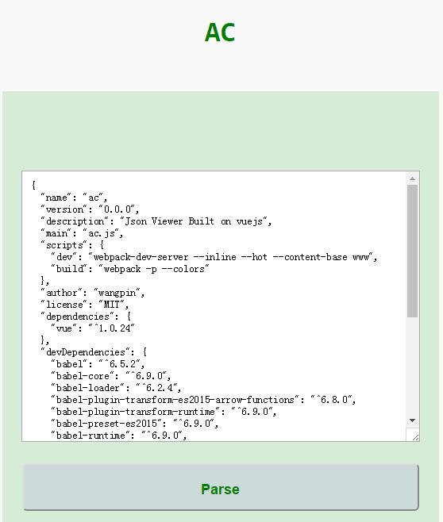
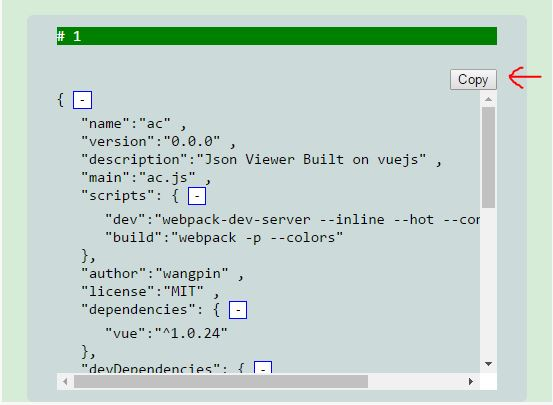

# AC
AC 是一个简单的 json formater。







## Contribution
AC 是使用 [vuejs](http://cn.vuejs.org/) 开发的，组件使用了 [vue component](http://cn.vuejs.org/guide/application.html#单文件组件)。复制功能使用到 [ZeroClipboard.js](https://github.com/zeroclipboard/zeroclipboard)。

### 搭建环境
* 克隆项目到本地

```
$ git clone git@github.com:wangpin34/ac.git
```
也可以 fork 之后再克隆。

*　安装依赖
```
$ npm install
```

*　启动开发模式
```
npm run dev
```

在浏览器中打开 http://localhost:8080 可以看到 AC 。

* 编译打包
```
npm run build
```

## LICENSE
MIT
